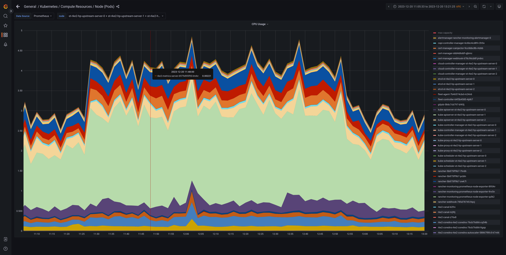
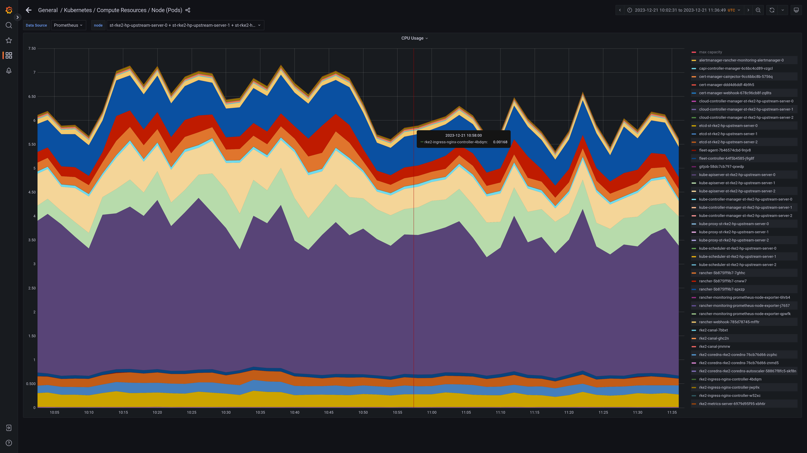
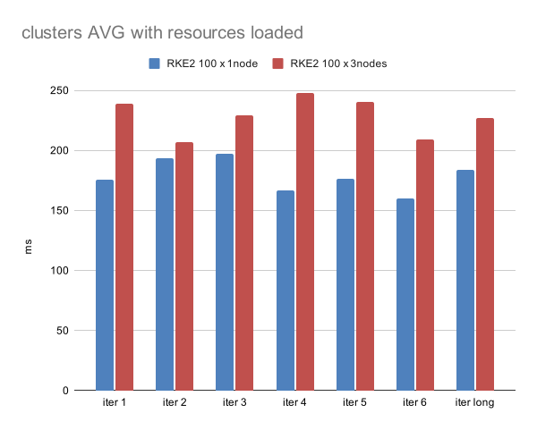

# 2023-12-01 - Performance measurements of RKE2 Rancher managing 100 downstream clusters of 1 vs 3 nodes each

This test measured resource queries to Rancher with and without extra resource loading and comparing the results between similar scenario setups: in both the scenarios Rancher manages 100 k3s clusters.
The scenarios differs in the number of nodes each one of these 100 clusters has: 1 node in the first scenario, 3 nodes in the other one.

## Results
Increasing the number of the nodes in the Rancher managed clusters impacts mainly performance and CPU usage. There is also a slight increase in the RAM usage.
In more details:
* **~100% CPU usage increase** on "idle" (not running any user task/workload).

* **~20% increases in the AVG (average) time** of the API response time (cluster resources, long iter) which raises to **50% for the P(95) serve time**.

* **~10% increase int the overall RAM usage**.
### Results - CPU usage
The increased CPU usage is particularly visible when Rancher cluster is loaded with some extra resources, bringing the total CPU usage of the 3 control plane nodes running Rancher from 3 cores to 6 cores when on idle.


_fig.1 - Cores usage in the Rancher Cluster - 100 x 1 downstream clusters_

</br>


_fig.2 - Cores usage in the Rancher Cluster - 100 x 3 downstream clusters_

</br>

The increase in the CPU usage to almost 5 cores in _fig.1_ and 7 cores in _fig.2_ is due to the start of the performance tests: the start time is at 11:25 for fig.1 and at 10:10 in fig.2.


With a fresh Rancher + downstream clusters deployment, the load is minimal and the CPU load varies from ~0.750 to ~0.950 cores. While these numbers are not one the double of the other, consider that with so low CPU usage the base OS processes running on the nodes have an higher CPU % footprint.
You can find more screenshots of the resource usage of these two scenarios in the [100 clusters x 1 node grafana screenshots folder](https://github.com/moio/scalability-tests/tree/20231222_rke2_100_clusters_1vs3_nodes_comparison/docs/20231222%20-%20RKE2%20100%20clusters%201vs3%20nodes%20comparison/grafana-screenshots/RKE4x) and in the [100 clusters x 3 nodes grafana screenshots folder](https://github.com/moio/scalability-tests/tree/20231222_rke2_100_clusters_1vs3_nodes_comparison/docs/20231222%20-%20RKE2%20100%20clusters%201vs3%20nodes%20comparison/grafana-screenshots/RKE5x).


### Results - performance measurements
To test the response time, we have queried Rancher for different cluster resources in different conditions (see the [process outline section](#process-outline) for more details).
The increased response time is clearly visible when extra resources are loaded. In particular the difference in the response times increases even higher when looking at the worst results (max and P(95)). For more information on the _avg_, _max_, _P(95)_ and other measured values check the [interpreting results section](#interpreting-results).



_fig.3 - Average response time for the management.cattle.io.clusters resource_

</br>


_fig.4 - 95° percentile response time for the management.cattle.io.clusters resource_

</br>

The above graphs compare side by side the two scenarios (100 clusters x 1 node vs 100 clusters x 3 nodes) querying the management.cattle.io.clusters resource multiple times. The tests have been run seven times (_iter #_) with the last one being longer and so performing much more iterations (see the [process outline section](#process-outline) for more details).
For more results, check the available data shared in the [available data section](#available-data).
## Hardware and infrastructure configuration outline

Scenarios provisioned on Azure Cloud:

RKE2 100 x 1 node scenario:
* Rancher cluster: 1 x
  * 3 CP Nodes: Standard_E8ads_v5 vm size (8 vCores, 64GB RAM)
  * 1 Agent Node: Standard_E8ads_v5 (dedicated to monitoring data collection)
* Downstream clusters: 100 x
  * 1 CP Node: Standard_B1ms (1 vCore, 2GB RAM)
* Tester cluster: 1 x
  * 1 CP Node: Standard_B2as_v2 (2 vCore, 8GB RAM)

RKE2 100 x 3 node scenario:
* Rancher cluster: 1 x
  * 3 CP Nodes: Standard_E8ads_v5 vm size (8 vCores, 64GB RAM)
  * 1 Agent Node: Standard_E8ads_v5 (dedicated to monitoring data collection)
* Downstream clusters: 100 x
  * 3 CP Nodes: Standard_B1ms (1 vCore, 2GB RAM)
* Tester cluster: 1 x
  * 1 CP Node: Standard_B2as_v2 (2 vCore, 8GB RAM)

## Process outline
For each of the two scenarios:
* started automated infrastructure deployment, Rancher installation and Downstream cluster import
* (1) started tests and collected results
  * 6 batches (iter #1 - #6) of 30 iterations, one longer batch of 1000 iterations (iter long)
* loaded resources on Rancher cluster:
  * 200 users.management.cattle.io
  * 200 globalroles.management.cattle.io
  * 200 globalrolebindings.management.cattle.io
  * 10000 configmaps
  * 50 projects.management.cattle.io
* (2) started tests and collected results
  * 6 batches (iter #1 - #6) of 30 iterations, one longer batch of 1000 iterations (iter long)
  * all the batches run to retrieve 3 different resources:
    * _management.cattle.io.settings_
    * _management.cattle.io.clusters_
    * _configmaps_

## Full configuration details

All infrastructure is defined in [Terraform](https://www.terraform.io/) files in the [20231222_rke2_100_clusters_1vs3_nodes_comparison](https://github.com/moio/scalability-tests/tree/20231222_rke2_100_clusters_1vs3_nodes_comparison/terraform) branch.

[k6](https://k6.io) load test scripts are defined in the [k6](https://github.com/moio/scalability-tests/tree/20231222_rke2_100_clusters_1vs3_nodes_comparison/k6) directory.

## Reproduction Instructions

### Requirements

- [Terraform](https://www.terraform.io/downloads)
- `git`
- `nc` (netcat)
- `make`
- [k6](https://k6.io)
- `node`
- `azure-cli`: (on macOS, use [Homebrew](https://brew.sh/): `brew install azure-cli`)

### Setup

Log into Azure via the CLI:
  - for SUSE employees: log into [OKTA](https://suse.okta.com), click on "Azure Landing Zone Office Portal", run `az login`

Deploy the RKE2 environment, install Rancher, set up clusters for tests:
```shell
# clone this project
git clone -b 20231222_rke2_100_clusters_1vs3_nodes_comparison https://github.com/moio/scalability-tests.git
cd scalability-tests

export TERRAFORM_WORK_DIR=terraform/main/azure


./bin/setup.mjs && ./bin/run_tests.mjs
````
>[!NOTE]
>by default the branch will setup the 100 clusters x 1 node scenario: if you want to run the 100 clusters x 3 nodes one you may want to change the server_count value in the [azure configuration file](https://github.com/moio/scalability-tests/blob/20231222_rke2_100_clusters_1vs3_nodes_comparison/terraform/main/azure/inputs.tf#L28) to 3 before running the /bin/setup.mjs && ./bin/run_tests.mjs command.

Once the system is provisioned, to get Rancher and clusters access info:

```shell
./bin/get_access.mjs
```


All created infrastructure can be destroyed at the end of the test via:
```shell
./bin/teardown.mjs
```

### Run tests

```shell
kubectl run -it --rm k6-manual-run --image=grafana/k6:latest --command sh
k6 run -e BASE_URL=${rancherClusterNetworkURL} -e USERNAME=admin -e PASSWORD=adminadminadmin -e RESOURCE=${resourceToTest} ./steve_paginated_api_benchmark.js
```
>[!NOTE]
>if you don't specify the _-e RESOURCE_ environment variable in the test,
_management.cattle.io.settings_ will be used.


#### Interpreting results
important output data points are:
 * `✓ checks`: number of successful checks. Presence of any errors invalidates the test
 * `http_req_duration`: duration of http requests to retrieve a page up to 100 resources
   * `avg` average duration of such requests
   * `min` minimum duration of such requests
   * `med` median duration of such requests
   * `max` maximum duration of such requests
   * `p(95)` 95th percentile - 95% of requests had a duration less than or equal to this value
   * `p(99)` 99th percentile - 99% of requests had a duration less than or equal to this value


## Available data
All the data collected from the tests is shared in the [_RKE2 100 clusters 1vs3 nodes comparison_ results directory](https://github.com/moio/scalability-tests/tree/20231222_rke2_100_clusters_1vs3_nodes_comparison/docs/20231222%20-%20RKE2%20100%20clusters%201vs3%20nodes%20comparison/).
There you will find:
* a list of the deployed scenarios ([_list.txt_ file](https://github.com/moio/scalability-tests/tree/20231222_rke2_100_clusters_1vs3_nodes_comparison/docs/20231222%20-%20RKE2%20100%20clusters%201vs3%20nodes%20comparison/list.txt))
* the raw data from the single tests ([_tests_raw_data_ folder](https://github.com/moio/scalability-tests/tree/20231222_rke2_100_clusters_1vs3_nodes_comparison/docs/20231222%20-%20RKE2%20100%20clusters%201vs3%20nodes%20comparison/tests_raw_data))
* screenshots from a Grafana dashboard showing CPU and Memory usage from the tested scenarios ([_grafana-screenshots_ folder](https://github.com/moio/scalability-tests/tree/20231222_rke2_100_clusters_1vs3_nodes_comparison/docs/20231222%20-%20RKE2%20100%20clusters%201vs3%20nodes%20comparison/grafana-screenshots))
* an [OpenDocument spreadsheet](https://github.com/moio/scalability-tests/tree/20231222_rke2_100_clusters_1vs3_nodes_comparison/docs/20231222%20-%20RKE2%20100%20clusters%201vs3%20nodes%20comparison/scalability_tests_summary.ods) containing all the results with few graphs


